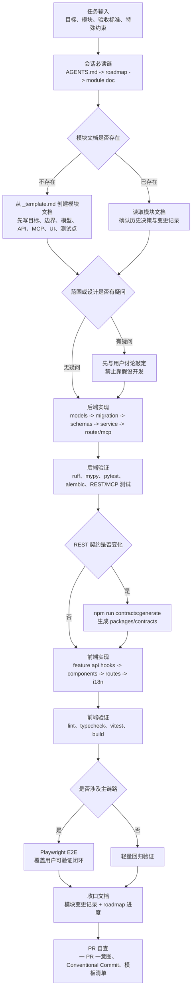
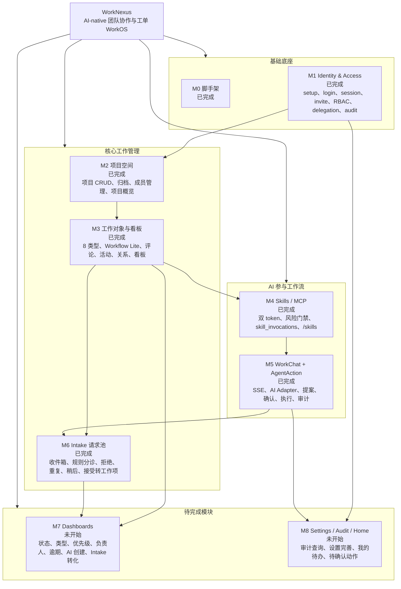
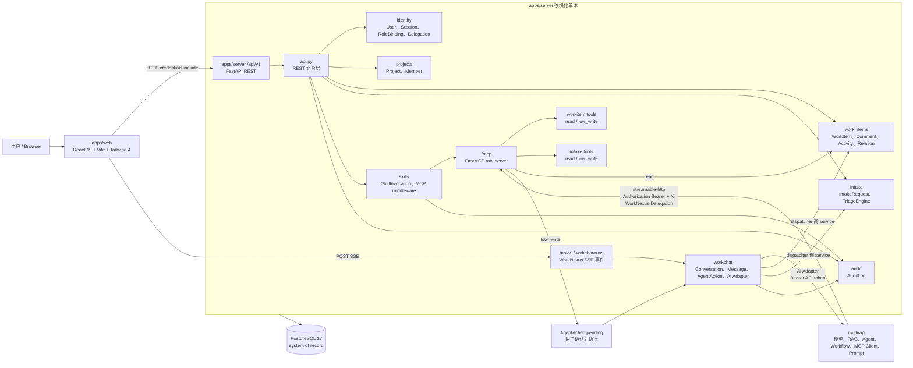
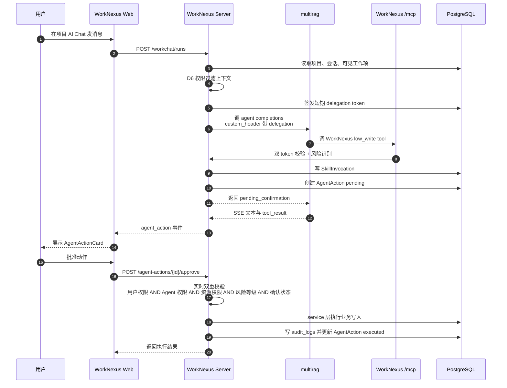
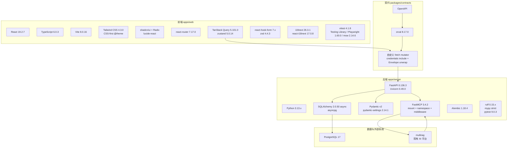
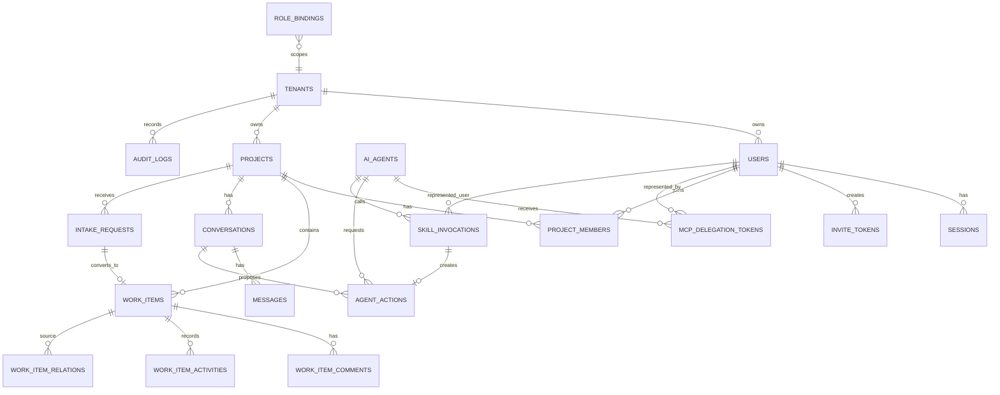
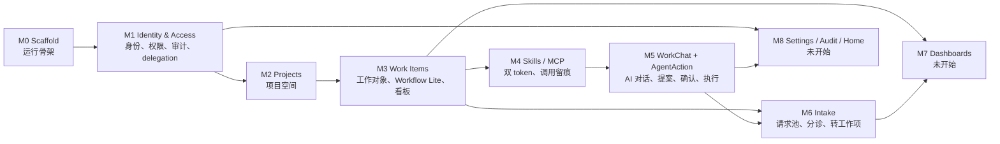

# WorkNexus 图谱集

> 本文件按当前仓库状态绘制：M0-M6 已完成，M7/M8 未开始；技术栈以 `docs/tech-stack.md` 的 2026-06-12 定版为准。

## 1. 开发流程图

## 2. 完整功能设计图

## 3. 系统架构图

## 4. AI 写动作安全链路图

## 5. 技术栈分层图

## 6. 数据域关系图

## 7. 模块依赖与实施顺序图

